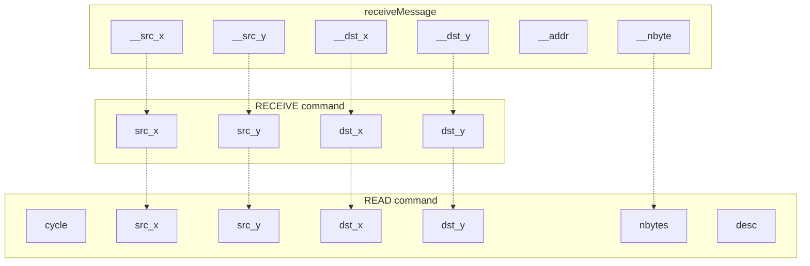
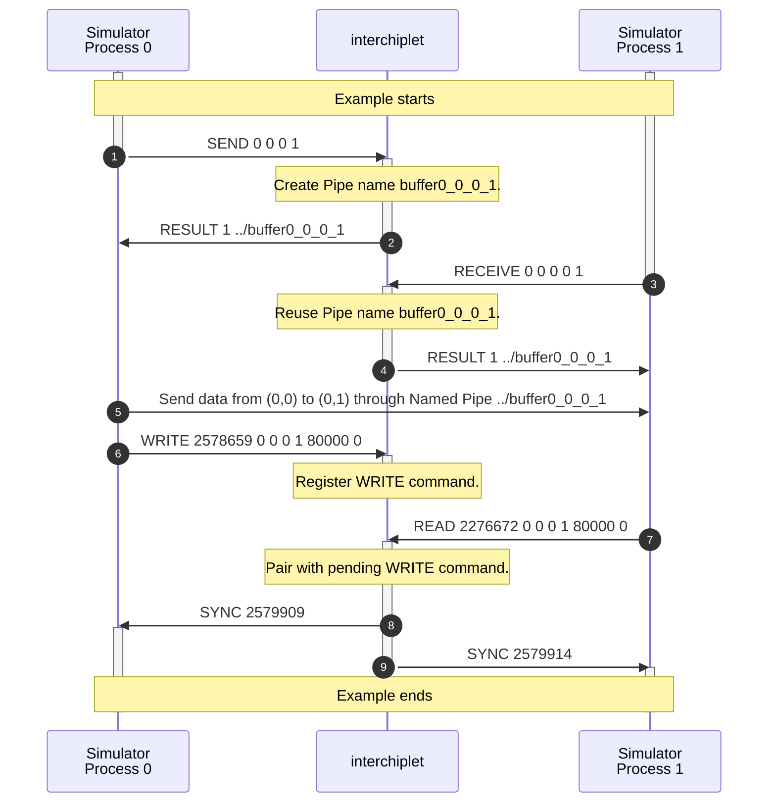
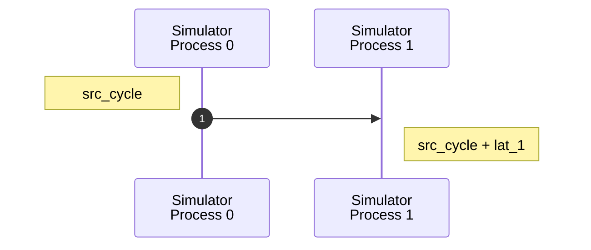

# Communication

You can find the following topics on this page:

- The sequences of synchronization protocol to handle communication transactions between processes.
- The algorithm to handle synchronization protocol within *interchiplet*.
- The algorithm to calculate the end cycle of one communication transaction.

## Command syntax

```
# sendMessage
SEND <src_x> <src_y> <dst_x> <dst_y>
WRITE <cycle> <src_x> <src_y> <dst_x> <dst_y> <nbytes> <desc>

# receiveMessage
RECEIVE <src_x> <src_y> <dst_x> <dst_y>
READ <cycle> <src_x> <src_y> <dst_x> <dst_y> <nbytes> <desc>
```

`src_x` and `src_y` present the source address and `dst_x` and `dst_y` present the destination address.

The `cycle` field in the WRITE command presents the time when the source component starts. The `cycle` field in the READ command presents the time when the destination component starts to wait for data to be ready for reading.

The `nbytes` field presents the total byte number of communication. `desc` describes the transaction behavior.

The figure below shows the relationship between arguments of APIs and commands.




## Command Sequence

One example of the command sequence is shown below:



*interchiplet* does not pair SEND and RECEIVE commands because the communication is handled by Named Pipes. Named Pipes already provide the functionality to synchronize the source and destination. As shown in the above example, the actual data transfer (5) operates after the RESULT command to Simulator Process 1 (4).


## Handle SEND and RECEIVE command

The SEND and RECEIVE commands are used to create a Named Pipe for each pair of communication. The SEND command is used at the source, while the RECEIVE command is used at the destination. The name of the Named Pipe is specified by the source and destination address, which is `buffer{src_x}_{src_y}_{dst_x}_{dst_y}`. For example, `buffer0_0_0_1` means the Pipe to send data from node (0,0) to node (0,1). If the request pipe does not exist, *interchiplet* creates one.

In the above example, Simulator Process 0 wants to send data to Simulator Process 1. *interchiplet* receives the SEND command (1) from Simulator Process 0 and creates the Pipe file. Then, *interchiplet* sends a RESULT command (2) to Simulator Process 0 with the name of the Pipe file. *interchiplet* directly issues the RESULT command (4) to Simulator Process 1 after receiving the RECEIVE command (3) from Simulation Process 1 because the required Pipe file already exists.

## Handle READ and WRITE command

The `cycle` field in the WRITE command presents the time when the source component starts to send data, referenced as `src_cycle`. The `cycle` field in the READ command presents the time when the destination component starts to wait for data to be ready for reading, referenced as `dst_cycle`.

The SYNC command after one WRITE command means the source has finished sending data. The SYNC command after one READ command means the destination has finished reading data. The task or flow in the source and destination can continue after receiving the SYNC command. The execution cycle of the source and destination should be adjusted to the value specified in the cycle field of SYNC commands.

In the above example, Simulator Process 0 sends the WRITE command (6) to *interchiplet* with `src_cycle`, and Simulator Process 1 sends the READ command (7) to *interchiplet* with `dst_cycle`. After pairing the WRITE and READ commands with the same source address, the same destination address, and the same number of bytes, *interchiplet* sends SYNC commands to Simulator Process 0 (8) and Simulator Process 1 (9) with the end cycle of the transaction.

Latency information provides two latency values (`lat_0` and `lat_1`) for one communication transaction:

- `lat_0` means the package latency from the source's view, including propagate latency.
- `lat_1` means the package latency from the destination's view, including the propagate latency and the transmission latency.

The package is injected at `src_cycle`. Hence, the package arrives at the destination at `src_cycle + lat_1`.

The timing sequence is shown below:



The destination does not need further blocking if `dst_cycle` is later than `src_cycle + lat_1`. Otherwise, the destination needs to block till `src_cycle + lat_1`.

In summary,

- The `cycle` of the SYNC command to the WRITE command is `src_cycle + lat_0`.
- The `cycle` of the SYNC command to the READ command is `max(src_cycle + lat_1, dst_cycle)`.

> TODO: Complex descriptor of communication transactions.
