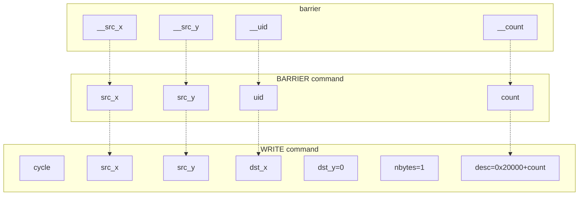
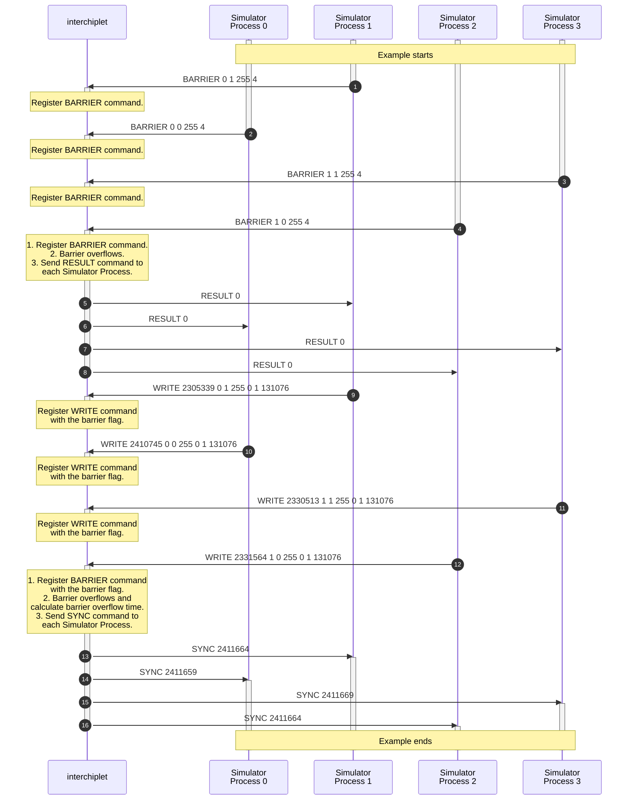
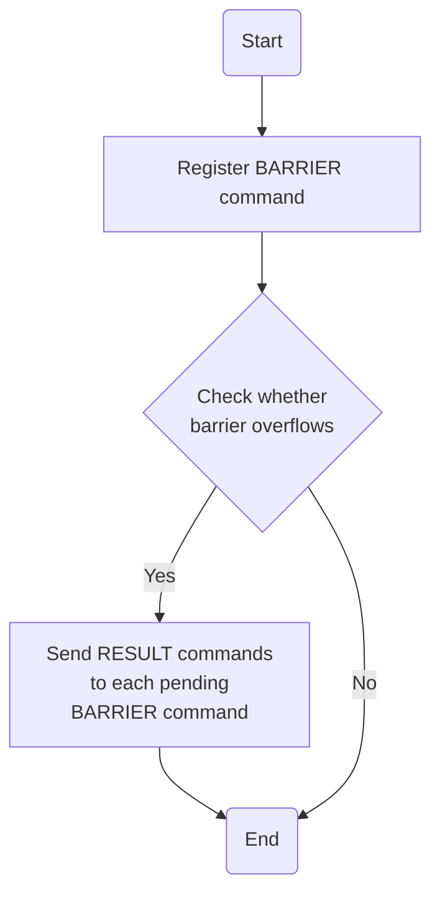
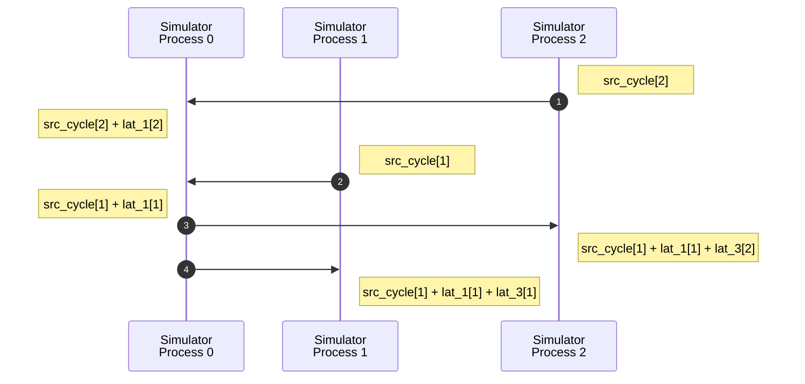

# Barrier

You can find the following topics on this page:

- The sequences of synchronization protocol to handle barrier transactions between processes.
- The algorithm to handle synchronization protocol within *interchiplet*.
- The algorithm to calculate the end cycle of one barrier transaction.

## Command syntax

```
# barrier
BARRIER <src_x> <src_y> <uid> <count>
WRITE <cycle> <src_x> <src_y> <dst_x> <dst_y> <nbytes=1> <desc=0x20000+count>
```

`src_x` and `src_y` present the source address of the process that enters the barrier. `uid` specifies the unique ID of the barrier. `count` specifies the number of processes that enter the barrier when the barrier overflows. Non-zero `count` always overrides the number of the barrier.

The `cycle` field in the WRITE command presents the time when the process enters the barrier.

The figure below shows the relationship between arguments of APIs and commands.



## Command Sequence

One example of the command sequence is shown below:



## Handle BARRIER Command

*interchiplet* emulates the function of the barrier. The following diagram shows the flow to handle one BARRIER command.



*interchiplet* response one RESULT command without any result for each process that enters the barrier when the barrier overflows.

> The order of BARRIER does not change by the timing information.

## Handle WRITE Command with the Barrier Flag

In a realistic system, when a process enters a barrier, the process sends one request to a controller, like a mailbox. Then, the process blocks till it receives the acknowledgment from the controller. The location of the controller is configured in Popnet.

The `cycle` field in the WRITE command with the barrier flag presents the time when the source component sends the barrier requirement to the controller in the system, referenced as `src_cycle`. WRITE commands with the barrier flag do not need to pair with READ commands.

The SYNC command after one WRITE command with the barrier flag means the source has received acknowledgment. The task or flow in the source can continue after receiving the SYNC command. The execution cycle of the source should be adjusted to the value specified in the cycle field of SYNC commands.

Latency information provides four latency values (`lat_0`, `lat_1`, `lat_2`, and `lat_3`) for one barrier transaction:

| | From the source's view | From the destination's view |
| ---- | :----: | :----: |
| **Request package** | `lat_0` | `lat_1` |
| **Acknowledgement package** | `lat_2` | `lat_3` |

The request package is injected at `src_cycle`. Hence, the request package arrives at the controller at `src_cycle + lat_1`. Then, when the barrier overflows, the controller sends one acknowledgment package to each source component.

The timing sequence is shown below:



In summary,

- The barrier overflow time is  `max(src_cycle[i] + lat_1[i])`.
- The `cycle` of the SYNC command to the WRITE command with the barrier flag is `barrier overflow time + lat_3`.
