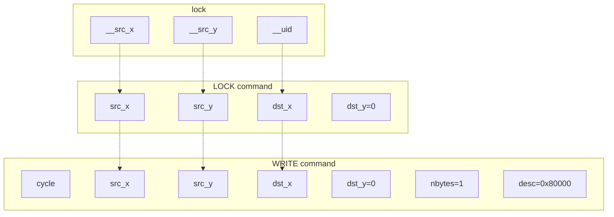
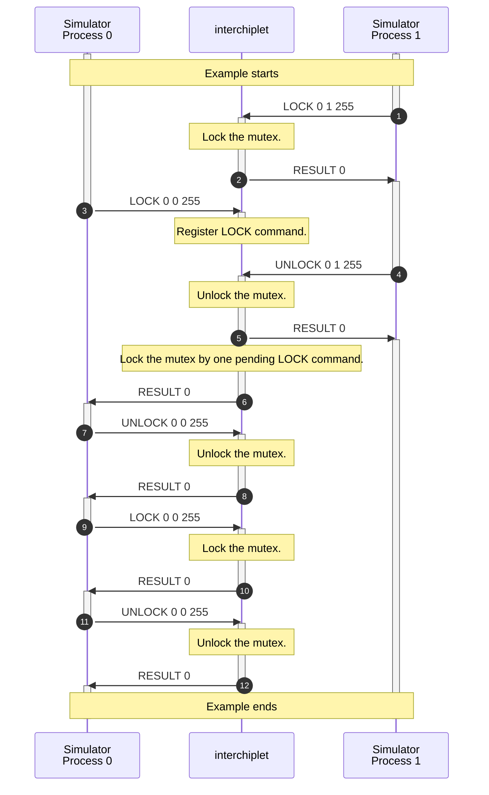
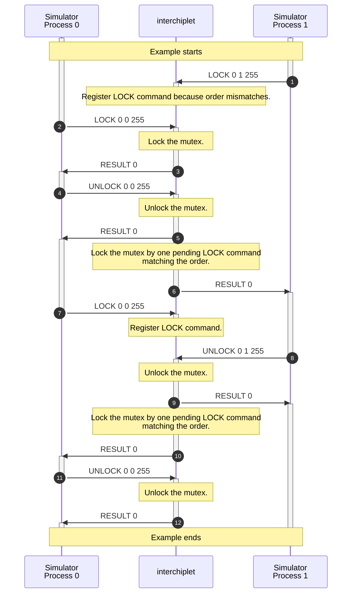

# Lock and Unlock

You can find the following topics on this page:

- The sequences of synchronization protocol to handle lock/unlock transactions between processes.
- The algorithm to handle synchronization protocol within *interchiplet*.
- The algorithm to calculate the end cycle of one lock/unlock transaction.

## Command syntax

```
# lock
LOCK <src_x> <src_y> <uid>
WRITE <cycle> <src_x> <src_y> <dst_x> <dst_y> <nbytes=1> <desc=0x40000>

# unlock
UNLOCK <src_x> <src_y> <uid>
WRITE <cycle> <src_x> <src_y> <dst_x> <dst_y> <nbytes=1> <desc=0x80000>
```

`src_x` and `src_y` present the source address of the process that locks or unlocks the mutex. `uid` specifies the unique ID of the mutex.

The `cycle` field in the WRITE command presents the time when the process locks or unlocks the mutex.




## Command Sequence


## Handle LOCK and UNLOCK Command

The LOCK and UNLOCK commands are used to lock one specified mutex. When one mutex is locked by one process, other processes cannot lock the mutex until the mutex is released. `uid` specifies the unique ID of the mutex.

The rules to handle LOCK and UNLOCK commands are listed below:

- When *interchiplet* receives one LOCK command,
    - If the specified mutex is locked, check the source of the LOCK command and the source that locked the specified mutex.
      - If the source of the LOCK command is the same as the source that locked the mutex, ignore the LOCK command. *interchiplet* returns one RESULT command without any result.
      - Otherwise, *interchiplet* registers the LOCK command.
    - Otherwise, *interchiplet* locks the mutex and returns one RESULT command without any result.
- When *interchiplet* receives one UNLOCK command,
    - If the specified mutex is locked, *interchiplet* unlocks the mutex and returns one RESULT command without any result.
        - If there are pending LOCK commands, select the first LOCK pending command to lock the mutex. *interchiplet* returns one RESULT command without any result to the selected LOCK command.
    - Otherwise, ignore the UNLOCK command. *interchiplet* returns one RESULT command without any result.

One example of the LOCK and UNLOCK commands is shown below.



Simulator Process 0 and Simulator Process 1 require the mutex 255. Simulator Process 1 locks the mutex first when *interchiplet* receives the LOCK command (1). Then, Simulator Process 0 requires the mutex by the LOCK command (3). Simulator Process 0 blocks until Simulator Process 1 releases the mutex by the UNLOCK command (4). Then, Simulator Process 0 blocks the mutex 255 twice.

With valid timing information, the order to lock the mutex is specified by the timing information, as bold sentences below.

- When *interchiplet* receives one LOCK command,
    - If the specified mutex is locked, check the source of the LOCK command and the source that locked the specified mutex.
        - If the source of the LOCK command is the same as the source that locked the mutex, ignore the LOCK command. *interchiplet* returns one RESULT command without any result.
        - Otherwise, *interchiplet* registers the LOCK command.
    - Otherwise, **check the source of the LOCK command with the order specified by timing information.**
        - If the source of the LOCK command matches the order specified by timing information, *interchiplet* locks the mutex and returns one RESULT command without any result.
        - Otherwise, *interchiplet* registers the LOCK command.
- When *interchiplet* receives one UNLOCK command,
    - If the specified mutex is locked, *interchiplet* unlocks the mutex and returns one RESULT command without any result.
        - If there are pending LOCK commands, **check whether the next source that lock the mutex exists in the pending LOCK commands, according to the timing information.**
            - If the command exists, select the matched LOCK pending command to lock the mutex. *interchiplet* returns one RESULT command without any result to the selected LOCK command.
            - Otherwise, do nothing.
    - Otherwise, ignore the UNLOCK command. *interchiplet* returns one RESULT command without any result.

As shown in the figure below, Simulator Process 0 locks the mutex first. Then Simulator Process 1 locks the mutex after Simulator Process 0 unlocks the mutex. At last, Simulator Process 0 locks the mutex again.



### Handle WRITE Command with the Lock and Unlock Flag

Similar to barrier transactions, when a process requires/releases one mutex, the process sends one request to a controller, like a mailbox. The location of the controller is configured in Popnet.

The `cycle` field in the WRITE command with the lock/unlock flag presents the time when the source component sends the lock/unlock requirement to the destination, referenced as `src_cycle`. WRITE commands with the lock/unlock flag do not need to pair with READ commands.

The SYNC command after one WRITE command with the lock/unlock flag means the source has received the acknowledgment. The task or flow in the source can continue after receiving the SYNC command. The execution cycle of the source should be adjusted to the value specified in the cycle field of SYNC commands.

Latency information provides four latency values (`lat_0`, `lat_1`, `lat_2`, and `lat_3`) for one lock/unlock transaction as one barrier transaction.

The request package is injected at `src_cycle`. Hence, the request package arrives at the controller at `src_cycle + lat_1`. If the mutex is not locked by `src_cycle + lat_1`, the controller sends the acknowledgment to the source. `dst_cycle` presents the cycle when the mutex is released.

The timing sequence of lock and unlock transactions is similar to the timing sequence of launch transactions. In summary,

- The `cycle` of the SYNC command to the WRITE command is `max(src_cycle + lat_1, dst_cycle) + lat_3`.
- The `cycle` of the SYNC command to the READ command is `max(src_cycle + lat_1, dst_cycle) + lat_2`.
