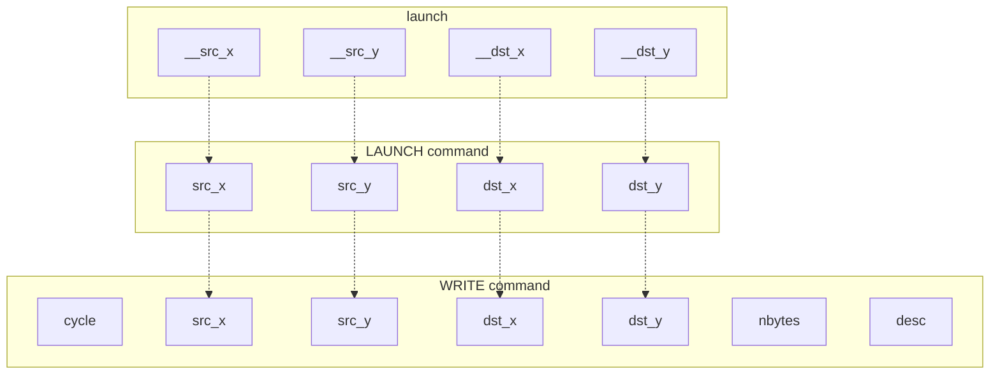
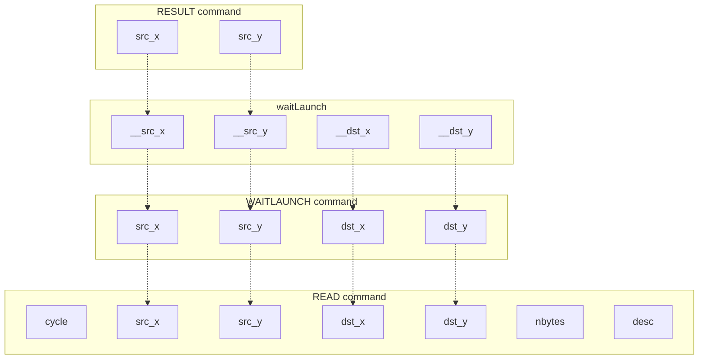
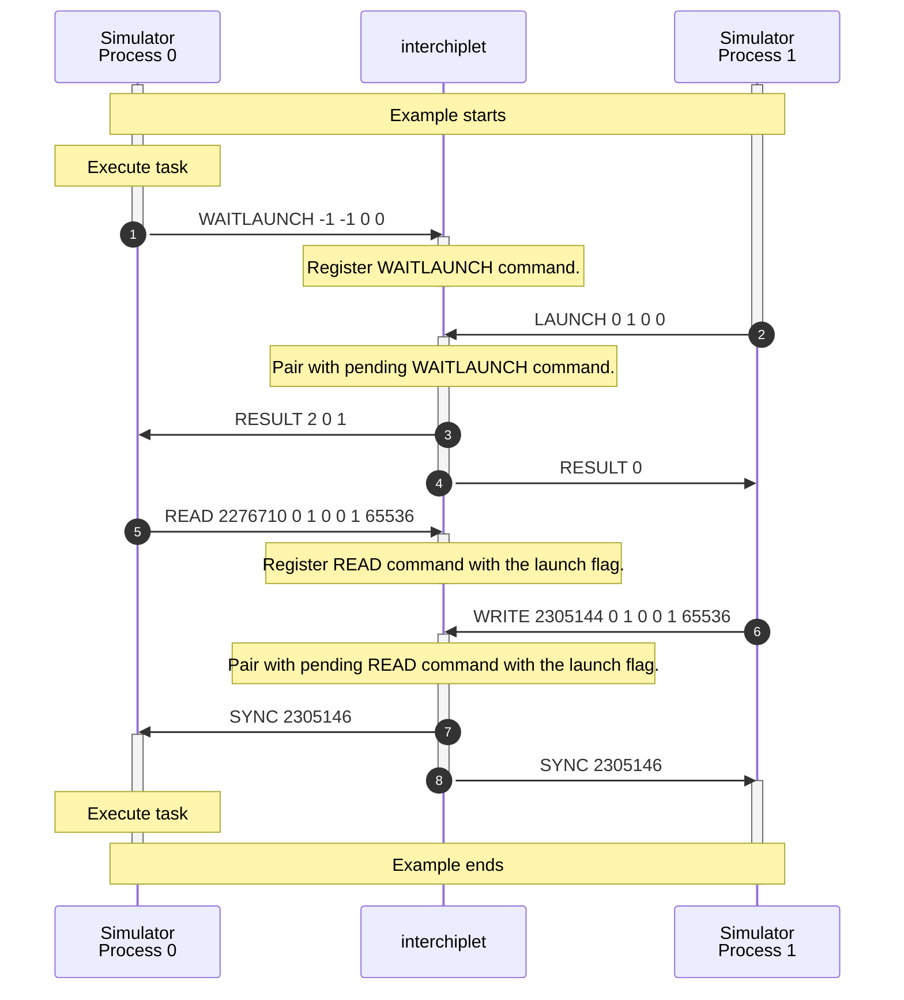
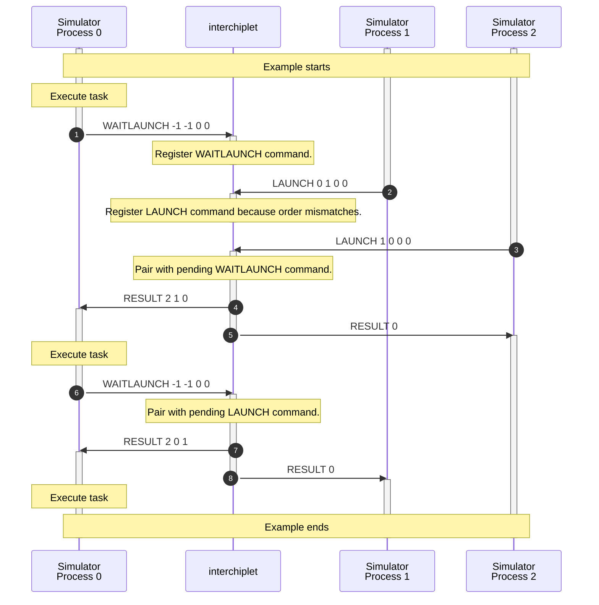
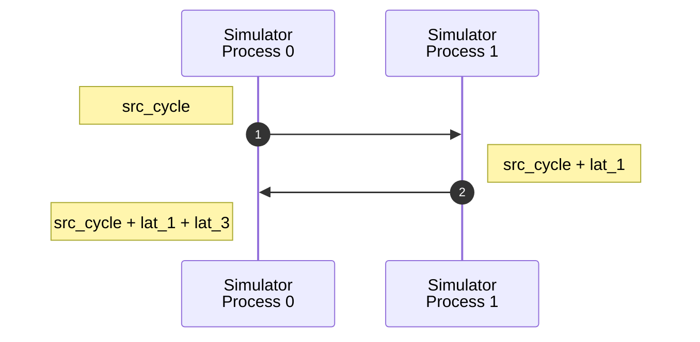
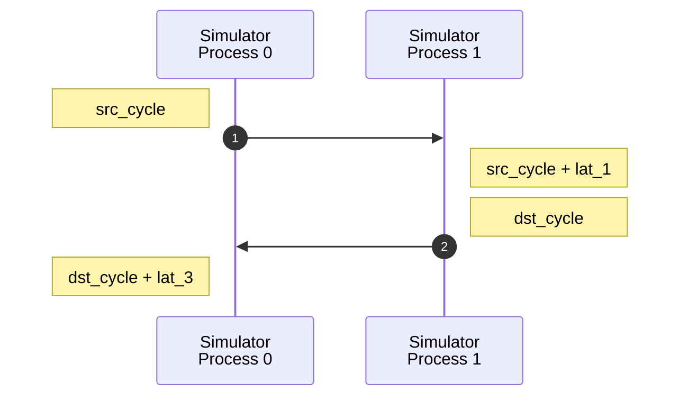

# Launch

You can find the following topics on this page:

- The sequences of synchronization protocol to handle launch transactions between processes.
- The algorithm to handle synchronization protocol within *interchiplet*.
- The algorithm to calculate the end cycle of one launch transaction.

## LAUNCH and WAITLAUNCH command

In the general program modeling for a heterogeneous system, CPUs take the role as the master and send LAUNCH commands to other computing resources, like GPUs and NPUs, to execute tasks. Computing resources remain idle until they receive LAUNCH commands.

Masters send LAUNCH commands with specified sources and destinations. Meanwhile, computing resources send WAITLAUNCH commands with the specified destinations but unknown sources (presented by -1,-1). *interchiplet* pairs one LAUNCH command and one WAITLAUNCH command with the same destination. Then, *interchiplet* sends one RESULT command without any result field to the master and one RESULT command with the source address to the computing resources.

```
# launch
LAUNCH <src_x> <src_y> <dst_x> <dst_y>
WRITE <cycle> <src_x> <src_y> <dst_x> <dst_y> <nbytes=1> <desc=0x10000>

# waitLaunch
WAITLAUNCH <src_x> <src_y> <dst_x> <dst_y>
WRITE <cycle> <src_x> <src_y> <dst_x> <dst_y> <nbytes=1> <desc=0x10000>
```

`src_x` and `src_y` present the master address and `dst_x` and `dst_y` present the slave address.

The `cycle` field in the WRITE command presents the time when the master component starts the launch request. The `cycle` field in the READ command presents the time when the destination component starts to wait for any launch request.

The figure below shows the relationship between arguments of APIs and commands.





## Command Sequence

One example of the command sequence is shown below:



## Handle LAUNCH and WAITLAUNCH Command

*interchiplet* pairs LAUNCH and WAITLAUNCH commands. If there is no latency information to reference, one WAITLAUNCH command should be paired with the first LAUNCH command with the same destination. Otherwise, the WAITLAUNCH command should be paired with the LAUNCH command specified by the latency information.

The RESULT command to the WAITLAUNCH command also provides the source address of the paired LAUNCH command.

```
RESULT 2 <src_x> <src_y>
```

In the above example, Simulator Process 0 is the computing resources controlled by Simulator Process 1. *interchiplet* pairs the WAITLAUNCH command (1) with the LAUNCH command (2) and sends RESULT commands to Simulator Process 0 (3) and Simulator Process 1 (4).

With valid timing information, the WAITLAUNCH command should pair with the specified LAUNCH command. The same scenario results in different timing sequences, as shown below.



According to the timing information, the WAITLAUNCH command (1) pairs with the LAUNCH command (3) from Simulator Process 2. Then, the second WAITLAUNCH command (6) pairs with the LAUNCH command (2).

## Handle READ and WRITE command

The `cycle` field in the WRITE command with the launch flag presents the time when the source component sends the launch requirement to the destination, referenced as `src_cycle`. The `cycle` field in the READ command presents the time when the destination component starts to wait for launch, referenced as `dst_cycle`.

The SYNC command after one WRITE command with the barrier flag means the source has received the acknowledgment. The SYNC command after one READ command means the destination has sent the acknowledgment. The task or flow in the source and destination can continue after receiving the SYNC command. The execution cycle of the source and destination should be adjusted to the value specified in the cycle field of SYNC commands.

Latency information provides four latency values (`lat_0`, `lat_1`, `lat_2`, and `lat_3`) for one launch transaction as one barrier transaction.

The request package is injected at `src_cycle`. Hence, the request package arrives at the controller at `src_cycle + lat_1`. Then, when the destination is waiting to launch (`dst_cycle`), the destination sends back the acknowledgment to the source.

If `dst_cycle` is earlier than `src_cycle`, the timing sequence is shown below:



If `dst_cycle` is later than `src_cycle`, the timing sequence is shown below:



In summary,

- The `cycle` of the SYNC command to the WRITE command is `max(src_cycle + lat_1, dst_cycle) + lat_3`.
- The `cycle` of the SYNC command to the READ command is `max(src_cycle + lat_1, dst_cycle) + lat_2`.
