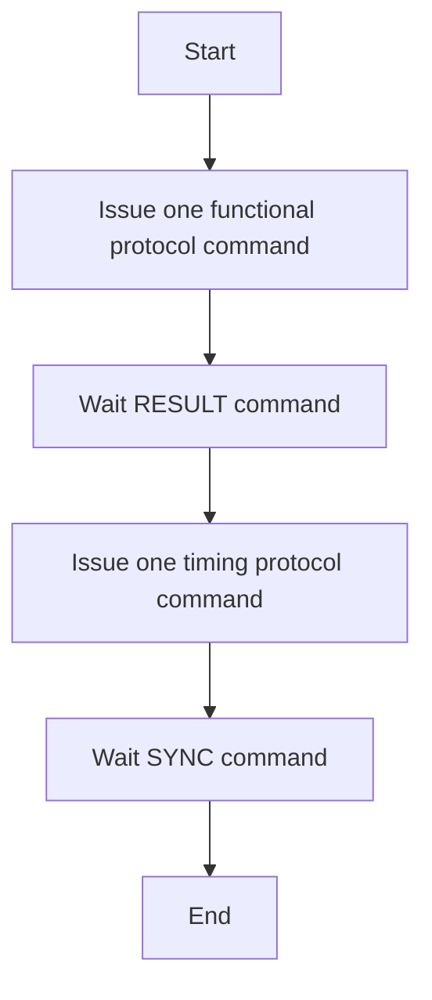

# Synchronization Protocol

You can find the following topics on this page:

- The synchronization protocol between simulation processes.

## List of Protocol Commands

Synchronization protocol can be categorized into functional protocol and timing protocol.

### Functional Protocol Commands

The functional protocol performs the functionality of benchmarks correctly, and commands do not care about the execution cycle. It is used in the functional model of simulators. Functional protocol commands and their syntax are listed below:

| Command      | Arguments                         | Direction | Location    | Pair with    | Usage |
| :----------: | --------------------------------- | :-------: | :---------: | :----------: | ----- |
| `BARRIER`    | `<src_x> <src_y> <uid> <count>`   | Up        | Source      | --           | The thread at the source enters the barrier. |
| `LAUNCH`     | `<src_x> <src_y> <dst_x> <dst_y>` | Up        | Source      | `WAITLAUNCH` | The thread at the source requires to execute a task at the destination. |
| `LOCK`       | `<src_x> <src_y> <uid>`           | Up        | Source      | `UNLOCK`     | The thread at the source requires to locking the mutex. |
| `RECEIVE`    | `<src_x> <src_y> <dst_x> <dst_y>` | Up        | Destination | `SEND`       | Receive data from the source to the destination. |
| `RESULT`     | `<res_num> [<res_0> <res_1> ...]` | Down      | --          | --           | Response to functional protocol commands with vary-number of results. |
| `SEND`       | `<src_x> <src_y> <dst_x> <dst_y>` | Up        | Source      | `RECEIVE`    | Send data from the source to the destination.  |
| `UNLOCK`     | `<src_x> <src_y> <uid>`           | Up        | Source      | `LOCK`       | The thread at the source unlocks the mutex. |
| `WAITLAUNCH` | `<src_x> <src_y> <dst_x> <dst_y>` | Up        | Destination | `LAUNCH`     | The thread at the destiantion waits to launch task. |

> "Up" means from simulation process to interchiplet. "Down" means from interchiplet to simulation process.

Every functional protocol command needs one RESULT command as the response. RESULT commands provide a list of result fields whose number is specified by `res_num`.

As the response to BARRIER, LOCK, UNLOCK, and LAUNCH commands, RESULT commands provide no result. As the response to SEND and RECEIVE commands, RESULT commands should provide the path of the Named Pipe. As the response to WAITLAUNCH commands, RESULT commands should provide the source of LAUNCH commands.

> TODO: More flexible format for address

### Timing Protocol Commands

The timing protocol synchronizes the execution cycles of simulators. It is used in the timing model of simulators. Timing protocol commands and their syntax are listed below:

| Command | Arguments                                                 | Direction | Location    | Pair with | Usage |
| :-----: | --------------------------------------------------------- | :-------: | :---------: | :-------: | ----- |
| `CYCLE` | `<cycle>`                                                 | Up        | Any         | --        | Report execution time of simulation processes. |
| `READ`  | `<cycle> <src_x> <src_y> <dst_x> <dst_y> <nbytes> <desc>` | Up        | Source      | `WRITE`   | Read transaction request from the source to the destination. |
| `SYNC`  | `<cycle>`                                                 | Down      | --          | --        | Response to timing protocol commands. |
| `WRITE` | `<cycle> <src_x> <src_y> <dst_x> <dst_y> <nbytes> <desc>` | Up        | Destination | `READ`    | Write transaction request from the source to the destination. |

As described in the [Overview](../index.md), the sequence to perform the communication between processes has been abstracted as the transaction. Hence, the essential read/write operations to lock flags are abstracted into READ/WRITE commands. READ/WRITE commands can be used for both communication and synchronization, such as barrier, lock, and launch. Therefore, **one READ or WRITE command presents a sequence of communication rather than one single package.** `desc` field defines the transaction's behavior.

Bit [19:16] presents the category of communication.

| Bit [19:16] | Behavior flag | Transaction's behavior |
| :---------: | :-----------: | ---------------------- |
| `0x0`       |               | Controlled by the bit [15:0] of `desc`. |
| `0x1`       | launch        | One request package and one acknowledgment package. |
| `0x2`       | barrier       | One request package and one acknowledgment package.  Bit [15:0] presents the number of processes when the barrier overflows. |
| `0x4`       | lock          | One request package and one acknowledgment package. |
| `0x8`       | unlock        | One request package and one acknowledgment package. |

READ/WRITE commands need SYNC commands as the response. SYNC commands provide a cycle to specify the end cycle of transactions.

> TODO: More flexible format for address

## APIs vs. Synchronization Protocol

Each API in benchmarks needs one command from the functional protocol and one from the timing protocol. Some trace-based simulators, like SniperSim, provide separated timing and function models. Hence, the functional protocol should not merge with the timing protocol.

| Benchmark API    | Command from functional protocol | Command from timing protocol  |
| :--------------: | :------------------------------: | :---------------------------: |
| `sendMessage`    | `SEND`                           | `WRITE`                       |
| `receiveMessage` | `RECEIVE`                        | `READ`                        |
| `barrier`        | `BARRIER`                        | `WRITE` with the barrier flag |
| `lock`           | `LOCK`                           | `WRITE` with the lock flag    |
| `unlock`         | `UNLOCK`                         | `WRITE` with the unlock flag  |
| `launch`         | `LAUNCH`                         | `WRITE` with the launch flag  |
| `waitLaunch`     | `WAITLAUNCH`                     | `READ` with the launch flag   |

The basic flow for APIs is shown below:

It is not necessary to implement the above flow in one single function. For those simulators that provide one separate function model and timing model, functional protocol commands are handled in the function model, and the timing protocol commands are handled in the timing model.

