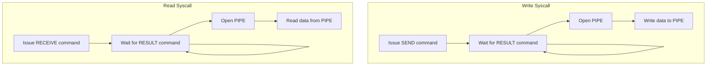
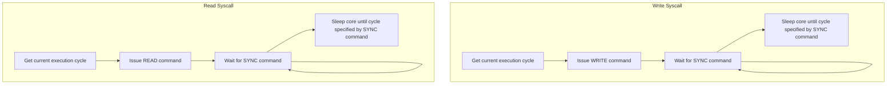
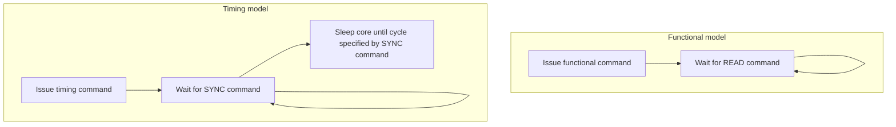

# Importing SniperSim

[SniperSim](http://snipersim.org//w/The_Sniper_Multi-Core_Simulator) is a trace-based CPU simulator that can achieve high speed and reasonable accuracy.

## APIs

APIs are implemented by System Calls. The following system call numbers are assigned to these APIs.

```c++
SYSCALL_LAUNCH = 501,        // Launch request.
SYSCALL_WAITLAUNCH = 502,    // Waiit launch request.
SYSCALL_BARRIER = 503,       // Enter barrier.
SYSCALL_LOCK = 504,          // Lock mutex.
SYSCALL_UNLOCK = 505,        // Unlock mutex.
SYSCALL_REMOTE_READ = 506,   // Read cross chiplet
SYSCALL_REMOTE_WRITE = 507,  // Write cross chiplet
```

Each benchmark API corresponds to one system call. All arguments of the benchmark APIs are also the arguments for system calls.

## Handle Syscalls

SniperSim provides separate functional and timing models. Hence, syscalls are handled separately in functional and timing models.

In the functional model, system calls are handled in file *$SIMULATOR_ROOT/snipersim/sift/recorder/syscall_modeling.cc*. In the timing model, system calls are handled in file *\$SIMULATOR_ROOT/snipersim/common/core/syscall_model.cc*.

### Handle SYSCALL_REMOTE_WRITE/SYSCALL_REMOTE_READ

The flow chart of the function model is as follows:



The flow chart of the timing model is as follows:



SniperSim is not a cycle-driven simulator. Hence, the execution cycle cannot be changed by modifying the value of some variables. Instead, one Sleep instruction is injected into the timing model, and the duration of the Sleep instruction equals the gap from the cycle issue one READ/WRITE command to the cycle receiving the corresponding SYNC command.

```c++
// Update simulator time.
ComponentPeriod time_wake_period = *(Sim()->getDvfsManager()->getGlobalDomain()) * end_time;
SubsecondTime time_wake = time_wake_period.getPeriod();
SubsecondTime sleep_end_time;
Sim()->getSyscallServer()->handleSleepCall(m_thread->getId(), time_wake, start_time, sleep_end_time);

// Sleep core until specified time.
if (m_thread->reschedule(sleep_end_time, core))
    core = m_thread->getCore();

core->getPerformanceModel()->queuePseudoInstruction(new SyncInstruction(sleep_end_time, SyncInstruction::SLEEP));
```

### Handle Other System Calls

Different from SYSCALL_REMOTE_READ and SYSCALL_REMOTE_WRITE, except functional and timing commands, it is not necessary to handle other functionality.

The flow chart is as follows:



The mapping between system calls and commands is shown below:

| System call          | Functional command | Timing command |
| -------------------- | :----------------: | :------------: |
| SYSCALL_LAUNCH       | `LAUNCH`           | `WRITE`        |
| SYSCALL_WAITLAUNCH   | `WAITLAUNCH`       | `READ`         |
| SYSCALL_BARRIER      | `BARRIER`          | `WRITE`        |
| SYSCALL_LOCK         | `LOCK`             | `WRITE`        |
| SYSCALL_UNLOCK       | `UNLOCK`           | `WRITE`        |
| SYSCALL_REMOTE_READ  | `READ`             | `READ`         |
| SYSCALL_REMOTE_WRITE | `WRITE`            | `WRITE`        |

## Issue CYCLE command

Because the CPU always controls the flow of benchmarks, the CPU's execution cycle plays a vital role in the execution cycle of the entire simulation. CYCLE command is issued in file *$SIMULATOR_ROOT/snipersim/common/core/core.cc*.
