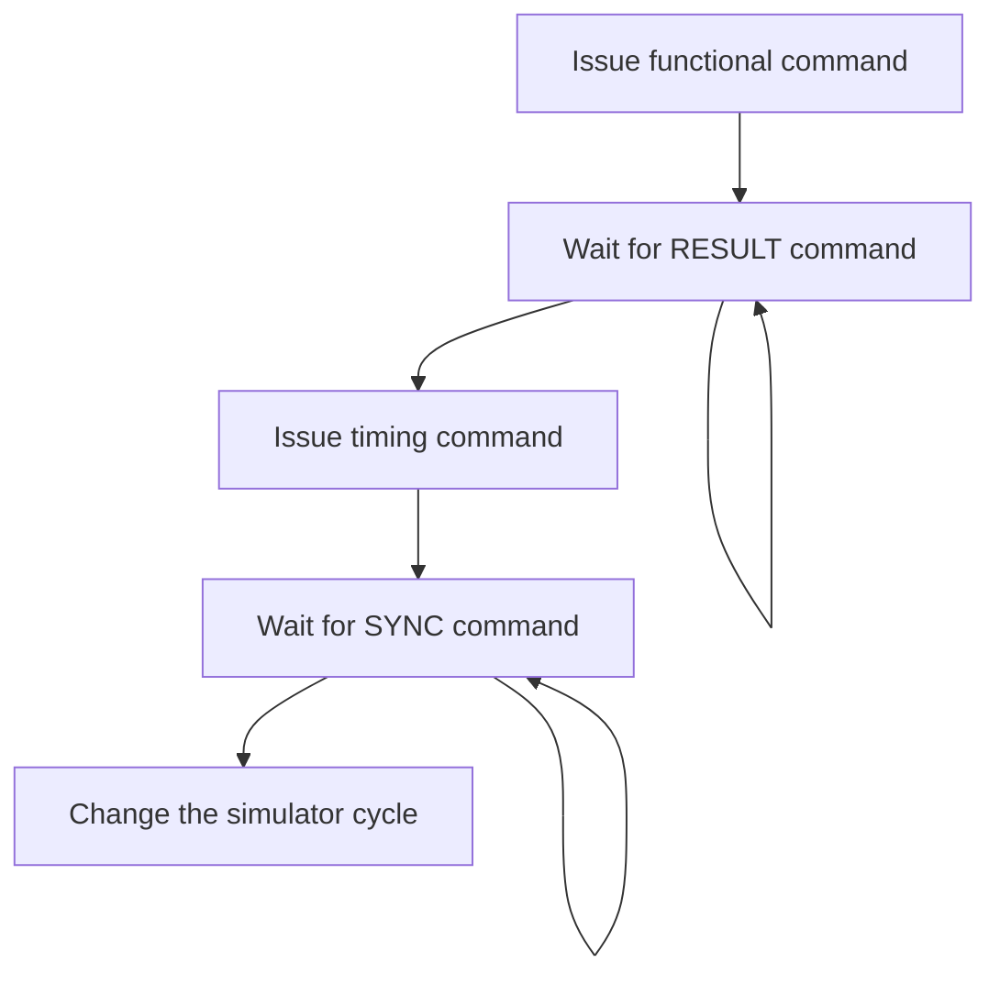

# Importing GPGPUSim

[GPGPUSim](http://www.gpgpu-sim.org) is a cycle-accurate model that simulates the micro-architecture of Nvidia GPGPU.

## APIs

In real GPGPU systems, benchmark APIs will be scheduled to particular APIs. For example, DMA units handle communication. The mailbox handles the barrier and lock. Therefore, benchmark APIs should be implemented by CUDA runtime APIs rather than kernels.

CUDA runtime APIs are declared and implemented in the CUDA kit. GPGPUSim provides a different runtime library **libcudart.so** rather than the standard runtime library from the CUDA kit. When compiling CUDA executable files, nvcc will link the standard runtime library.

Benchmark APIs are added to the runtime library provided by GPGPUSim. APIs are implemented in file *$SIMULATOR_ROOT/gpgpu-sim/libcuda/cuda_runtime_api.cc*. Hence, when compiling CUDA executable files, the path to search libraries must be redirected to GPGPUSim:

```
nvcc -L$(SIMULATOR_ROOT)/gpgpu-sim/lib/$(GPGPUSIM_CONFIG) --cudart shared $(CUDA_OBJS) -o $(CUDA_TARGET)
```

### sendMessage and receiveMessage

The flow chart of `sendMessage` and `receiveMessage` is as follows:

```mermaid
flowchart TD

subgraph Write Syscall
O1(Start)
A1[Copy data from device to host]
B1[Issue SEND command]
C1[Wait for RESULT command]
D1[Open Pipe]
E1[Write data to Pipe]
F1[Get current simulation cycle]
G1[Send WRITE command]
H1[Wait for SYNC command]
I1[Adjust simulation cycle]
Z1(End)
end

O1-->A1-->B1-->C1-->D1-->E1-->F1-->G1-->H1---->I1-->Z1
C1-->C1
H1-->H1

subgraph Read Syscall
O2(Start)
A2[Issue RECEIVE command]
B2[Wait for RESULT command]
C2[Open Pipe]
D2[Read data from Pipe]
E2[Get current simulation cycle]
F2[Send READ command]
G2[Wait for SYNC command]
H2[Write data from host to device]
I2[Adjust simulation cycle]
Z2(End)
end

O2---->A2-->B2-->C2-->D2-->E2-->F2-->G2-->H2-->I2-->Z2
B2-->B2
G2-->G2
```



CUDA provides memory copy APIs to transfer data between the host and the device.

```C++
// From the device to the host, used by sendMessage
cudaMemcpy(interdata, __addr, __nbyte, cudaMemcpyDeviceToHost);

// From the host to the device, used by receiveMessage
cudaMemcpy(__addr, interdata, __nbyte, cudaMemcpyHostToDevice);
```

GPGPUSim is a cycle-driven simulator whose cycle loop can be found in file *\$SIMULATOR_ROOT/gpgpu-sim/src/gpgpu-sim/gpu-sim.h* and *\$SIMULATOR_ROOT/gpgpu-sim/src/gpgpu-sim/gpu-sim.cc*.

GPGPUSim applies two variables to record the execution cycles: `gpgpu_sim::gpu_sim_cycle` and `gpgpu_sim::gpu_tot_sim_cycle`. The sum of these two variables presents the real consumed cycle, which should be replaced by the cycle value in the SYNC command.

When GPGPUSim handles CUDA APIs, the cycle loop has not started. Hence, `gpgpu_sim::gpu_sim_cycle` can be directly modified:

```c++
// Get the current cycle.
gpgpu_sim *gpu = GPGPU_Context()->the_gpgpusim->the_context->get_device()->get_gpgpu();
long long unsigned int timeNow = gpu->gpu_sim_cycle + gpu->gpu_tot_sim_cycle;

long long int timeEnd = ...

// Update the current cycle.
gpu->gpu_tot_sim_cycle = timeEnd - gpu->gpu_sim_cycle;
```

### Other APIs

Different from `sendMessage` and `receiveMessage`, except for functional and timing commands, it is not necessary to handle other functionality.

The flow chart is as follows:



The mapping between APIs and commands is shown below:

| System call      | Functional command | Timing command |
| ---------------- | :----------------: | :------------: |
| `launch`         | `LAUNCH`           | `WRITE`        |
| `waitlaunch`     | `WAITLAUNCH`       | `READ`         |
| `barrier`        | `BARRIER`          | `WRITE`        |
| `lock`           | `LOCK`             | `WRITE`        |
| `unlock`         | `UNLOCK`           | `WRITE`        |
| `receiveMessage` | `READ`             | `READ`         |
| `sendMessage`    | `WRITE`            | `WRITE`        |

## Issue CYCLE command

The task on the GPU is triggered by CPUs in the system. CPUs prepare the data required by tasks and accept the generated result. The execution cycle of CPUs reflects the execution cycle of GPUs through the synchronization performed by data transmission. Therefore, GPGPUSim does not issue CYCLE commands.
