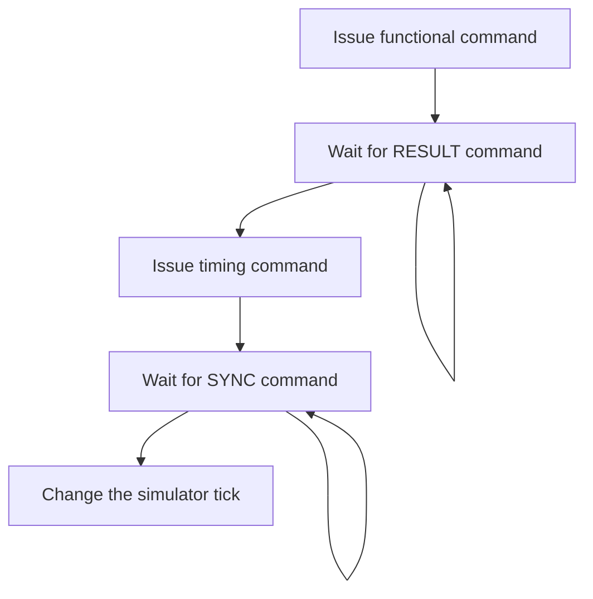
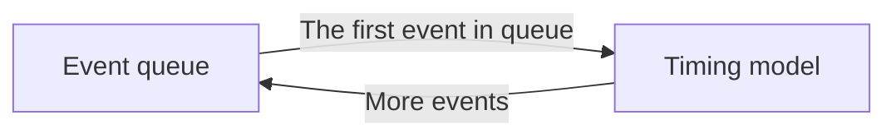

# Importing GEM5

[GEM5](https://github.com/gem5/gem5) provides a powerful platform to study the architecture and micro-architecture of computer systems. It is widely used in both academic and industrial fields.

Currently, supported ISAs include X86 and ARM. Supported timing models include AtomicSimpleCPU, TimingSimpleCPU, and O3CPU.

## APIs

APIs are implemented by System Calls. The following system call numbers are assigned to these APIs.

```c++
SYSCALL_LAUNCH = 501,        // Launch request.
SYSCALL_WAITLAUNCH = 502,    // Waiit launch request.
SYSCALL_BARRIER = 503,       // Enter barrier.
SYSCALL_LOCK = 504,          // Lock mutex.
SYSCALL_UNLOCK = 505,        // Unlock mutex.
SYSCALL_REMOTE_READ = 506,   // Read cross chiplet
SYSCALL_REMOTE_WRITE = 507,  // Write cross chiplet
```

Each benchmark API corresponds to one system call. All arguments of the benchmark APIs are also the arguments for system calls.

## Handle Syscalls

Gem5 is categorized as an execution-driven simulation. The timing model will call the function model at the right time one instruction by one instruction. Hence, the functional commands and the timing commands can be handled in the same place.

Gem5 provides unified function models for all timing models. The function models for all ISAs are implemented in folder `src/arch`. Each ISA has different syscall lists.

- *$SIMULATOR_ROOT/gem5/src/arch/x86/linux/syscall_tbl32.cc* and *\$SIMULATOR_ROOT/gem5/src/arch/x86/linux/syscall_tbl64.cc* define the syscall list for x86.
- *$SIMULATOR_ROOT/gem5/src/arch/arm/linux/se_workload.cc* defines the syscall list for ARMv8 ISA.

Different ISAs apply the same emulator of syscalls. You can find the handler for all syscalls in *$SIMULATOR_ROOT/gem5/src/sim/syscall_emul.hh* and *\$SIMULATOR_ROOT/gem5/src/sim/syscall_emul.cc*. 

### Handle SYSCALL_REMOTE_WRITE/SYSCALL_REMOTE_READ

The flow chart of `SYSCALL_REMOTE_WRITE` and `SYSCALL_REMOTE_READ` is as follows:

```mermaid
flowchart TD

subgraph Write Syscall
O1(Start)
A1[Copy data out of simulation space]
B1[Issue SEND command]
C1[Wait for RESULT command]
D1[Open Pipe]
E1[Write data to Pipe]
F1[Get current simulation cycle]
G1[Send WRITE command]
H1[Wait for SYNC command]
I1[Adjust simulation cycle]
Z1(End)
end

O1-->A1-->B1-->C1-->D1-->E1-->F1-->G1-->H1---->I1-->Z1
C1-->C1
H1-->H1

subgraph Read Syscall
O2(Start)
A2[Issue RECEIVE command]
B2[Wait for RESULT command]
C2[Open Pipe]
D2[Read data from Pipe]
E2[Get current simulation cycle]
F2[Send READ command]
G2[Wait for SYNC command]
H2[Copy data into simulation space]
I2[Adjust simulation tick]
Z2(End)
end

O2---->A2-->B2-->C2-->D2-->E2-->F2-->G2-->H2-->I2-->Z2
B2-->B2
G2-->G2
```



### Other Syscalls

Different from `SYSCALL_REMOTE_WRITE` and `SYSCALL_REMOTE_READ`, except for functional and timing commands, it is not necessary to handle other functionality.

The flow chart is as follows:



The mapping between APIs and commands is shown below:

| System call      | Functional command | Timing command |
| ---------------- | :----------------: | :------------: |
| `launch`         | `LAUNCH`           | `WRITE`        |
| `waitlaunch`     | `WAITLAUNCH`       | `READ`         |
| `barrier`        | `BARRIER`          | `WRITE`        |
| `lock`           | `LOCK`             | `WRITE`        |
| `unlock`         | `UNLOCK`           | `WRITE`        |
| `receiveMessage` | `READ`             | `READ`         |
| `sendMessage`    | `WRITE`            | `WRITE`        |

## Adjust Simulator Tick

In order to deal with multiple clock domains in computer systems, the basic timing unit in Gem5 is called `Tick` instead of the cycle. Considering one chiplet with multiple clock domains, we prefer to handle the unit transaction by benchmark configuration files (.yaml). 

For example,

```yaml
  - cmd: "$SIMULATOR_ROOT/gem5/build/X86/gem5.opt"
    args: ["$SIMULATOR_ROOT/gem5/configs/deprecated/example/se.py", "--cmd", "$BENCHMARK_ROOT/bin/test_c", "-o", "0 0"]
    log: "gem5.0.0.log"
    is_to_stdout: false
    clock_rate: 500
```

The kernel simulation loop of Gem5 is one event queue. Timing models handle the first event in the queue and inject for events if necessary.



Two global variables are added in *$SIMULATOR_ROOT/gem5/src/sim/eventq.hh* and *\$SIMULATOR_ROOT/gem5/src/sim/eventq.cc* so that all components can access them.

- `gem5::interchiplet_end_tick_valid` means whether it is necessary to change the simulator tick.
- `gem5::interchiplet_end_tick` means the target to change the simulator tick.

In AtomicSimpleCPU, the timing model injects one tick event into the event queue every cycle. When the simulator tick needs changing, the latency is added to the next tick event so the simulator can move forward to the target time. See *$SIMULATOR_ROOT/gem5/src/cpu/simple/atomic.cc* for details.

In TimingSimpleCPU, the timing model injects one fetch event into the event queue for each bubble. When the simulator tick needs changing, the next fetch event is injected into the event queue at the target time. See *$SIMULATOR_ROOT/gem5/src/cpu/simple/timing.cc* for details.

In O3CPU, the timing model also injects one tick event into the event queue every cycle. Hence, the next tick event is injected at the target time when the tick needs changing. See *$SIMULATOR_ROOT/gem5/src/cpu/o3/cpu.cc* for details.

## Issue CYCLE command

Because the CPU always controls the flow of benchmarks, the CPU's execution cycle plays a vital role in the execution cycle of the entire simulation. CYCLE command is issued in file *$SIMULATOR_ROOT/gem5/src/sim/sim_event.cc* when the simulator quits the simulation loop.

## Cross-compile for ARM ISA

As a universal simulation platform, Gem5 supports multiple ISAs. Syscalls required to handle benchmark APIs have been added to x86 and ARM ISA. Hence, Gem5 in LegoSim can also execute ARM benchmarks.

The following command installs the cross-compiler for ARM.

```shell
sudo apt install gcc-aarch64-linux-gnu
```

Then, you can use `aarch64-linux-gnu-gcc` and `aarch64-linux-gnu-g++` to compile benchmarks just like `gcc` and `g++`.

> Wnen apply ARM cross compile, `interchiplet_c` cannot be used. `apis_c.cpp` should be compiled to one object file and linked to the target.

For example,

```makefile
# C language target
C_target: $(C_OBJS) obj/interchiplet.o
	$(CC) $(C_OBJS) obj/interchiplet.o -o $(C_TARGET)

# Interchiplet library
obj/interchiplet.o: ../../../../interchiplet/srcs/apis_c.cpp
	$(CC) $(CFLAGS) -c $< -o $@

# Rule for C object
obj/%.o: ../../snipersim/barrier/%.cpp
	$(CC) $(CFLAGS) -c $< -o $@
```
