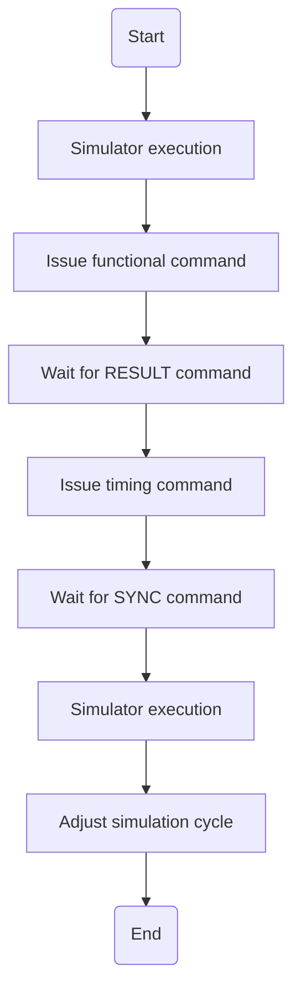
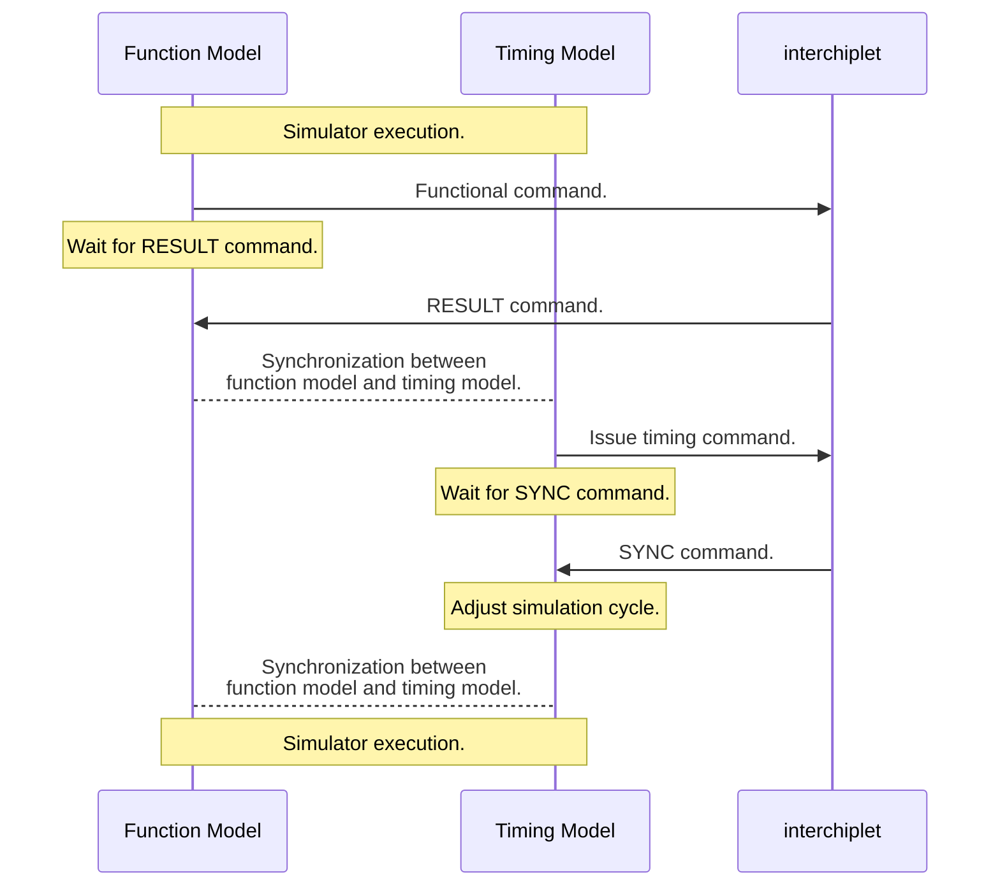
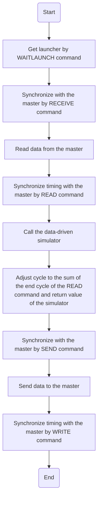

# Importing Simulators

You can learn the following topics from this page:

- How to import a new simulator?
- Function and APIs provided for imported simulators.

## The tasks to import a new simulator

1. Provide an implementation of APIs in benchmarks. See [Benchmark](../02-benchmarks/021-apis/index.md) for the API list.

   For example, APIs may implemented by system calls in one CPU simulator. Meanwhile, APIs may implemented by CUDA APIs or CUDA kernals in one GPGPU simulator.

   See *apis_c.hpp* and *apis_cu.hpp* as examples.

2. Find out one method to change the simulation cycle of the new simulator.

    For example, there is one global simulation cycle in GPGPUSim and GM5, which can be changed directly. However, in SniperSim, one sleep pseudo-instruction should be injected into the trace to delay the simulation cycle.

3. Implement synchronization protocol.

    The way to send and receive protocol commands in one simulator depends on how the simulator is implemented. Please check below for details.

### Cycle-driven Simulator

Cycle-driven simulators are driven by a loop in the simulation cycle. In each iteration, the behavior of hardware in one cycle is emulated. In every iteration, both the functional and timing models are executed.

The figure below shows the abstracted model for one iteration in cycle-driven simulators.



Commands are issued somewhere in the simulator, such as the commit stage of the CPU pipeline. The functional and timing commands are issued continuously. The SYNC command returns the end cycle of the transaction. However, the simulation cycle must be updated at the end of this iteration to avoid program crush.

### Trace-driven Simulator

Trace-driven simulators provide separate function models and timing models. Function models generate traces, and traces drive timing models. The timing model can be driven by one trace generated by one function model running simultaneously. Otherwise, the trace can be generated before executing the timing model.

In trace-driven simulators that execute functional and timing models simultaneously, functional commands are issued in the function model, and timing commands are issued in the timing model. The order to issue commands should be carefully controlled:



In trace-driven simulators driven by offline traces, timing models should issue both functional and timing commands, similar to cycle-driven simulators. Moreover, the timing models should be able to provide transmission data to other simulators because other simulators may need these data for their functional model.

See [SniperSim](041-snipersim.md) as an example.

### Data-driven Simulator

Data-driven simulators are usually used to emulate application-specific IPs, such as ISPs, NN accelerators, and in-memory accelerators. These simulators usually accept input data, emulate the IP's functionality, and return output data and the elapsed cycle.

It is not necessary to add APIs in the data-driven simulators. Instead, wrappers can be used to adapt data-driven simulators to LegoSim. One task on data-driven simulators is shown below:



The SYNC command after the READ command returns the end cycle of input data transmission. It is also the start cycle of the data-driven simulator. The elapsed cycle of the data-driven simulator is added to the start cycle. Then, the WRITE command sends the result as the start cycle of output data transmission.

# Utility APIs

*$SIMULATOR_ROOT/interchiplet/includes/pipe_comm.h* provides utility APIs to handle synchronization protocol.

The following APIs exist in `pipe_comm` to issue commands:

- `InterChiplet::sendSync` sends a SEND command and waits for a RESULT command. This function returns the name of the generated Named Pipe.
- `InterChiplet::receiveSync` sends a RECEIVE command and waits for a RESULT command. This function returns the name of the generated Named Pipe.
- `InterChiplet::launchSync` sends a LAUNCH command and waits for a RESULT command. This function has no return value.
- `InterChiplet::waitlaunchSync` sends a WAITLAUNCH command and waits for a RESULT command. This function returns the address of the source through data pointers.
- `InterChiplet::barrierSync` sends a BARRIER command and waits for a RESULT command. This function has no return value.
- `InterChiplet::lockSync` sends a LOCK command and waits for a RESULT command. This function has no return value.
- `InterChiplet::unlockSync` sends a UNLOCK command and waits for a RESULT command. This function has no return value.

- `InterChiplet::sendCycleCmd` sends CYCLE command.
- `InterChiplet::readSync` sends a READ command and waits for a SYNC command. The function returns the cycle specified by the SYNC command.
- `InterChiplet::writeSync` sends a WRITE command and waits for a SYNC command. The function returns the cycle specified by the SYNC command.

To reduce the overhead of opening, closing, reading, and writing Pipes, *pipe_comm.h* abstracts operations into the interface class `InterChiplet::PipeComm`. `PipeComm` holds a list of opened pipes and one data buffer for each. So that one pipe is opened only once during one simulator process. Meanwhile, many reads with small sizes are regulated to less read with the data buffer's size.

The usage of `InterChiplet::PipeComm` is as follows:

```c++
InterChiplet::PipeComm global_pipe_comm;    // It is suggested that the global entity of PipeComm be declared.

char * fileName = InterChiplet::SyncProtocol::pipeName(src_x, src_y, dst_x, dst_y);    // It is suggested to use APIs to get the file name of pipes.
global_pipe_comm.write_data(fileName, interdata, nbytes);    // Write data to Pipe
global_pipe_comm.read_data(fileName, interdata, nbytes);     // Read data to Pipe
```

::: doxy.Class
    name: InterChiplet::PipeComm

# Generate Patch and Apply Patch

Although imported simulators need a minor change to support the synchronization protocol, third-party simulators are still suggested to be imported as git submodules. The purpose behind such suggestions is to keep the repository clean and respect the spirit of open-source. The minor modifications should be stored in a dedicated diff file for each simulator.

[*patch.sh*](https://github.com/FCAS-ZJU/Chiplet_Heterogeneous_newVersion/blob/master_v2/patch.sh) is used to create .diff patches for all simulators. It will also copy modified files to *.cache*. It is forbidden to copy files in *.cache* to the directory of simulators because the copy operation cannot be redrawn. However, the file in *.cache* can be used as a reference when recovering from git confliction.

[*apply_patch.sh*](http://github.com/FCAS-ZJU/Chiplet_Heterogeneous_newVersion/blob/master_v2/apply_patch.sh) will apply .diff patches to all simulators. `git reset` is necessary for each simulator before *apply_patch.sh* to avoid git confliction.

When adding new simulators, it is necessary to add the path of the new simulators to *patch.sh* and *apply_patch.sh*.
