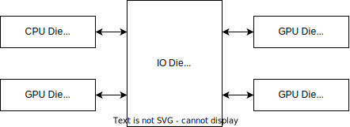
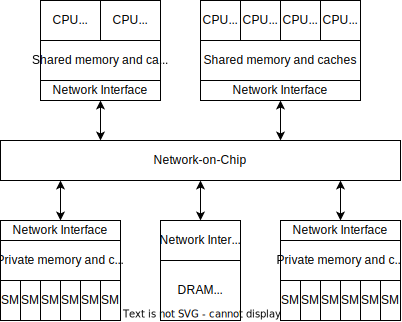
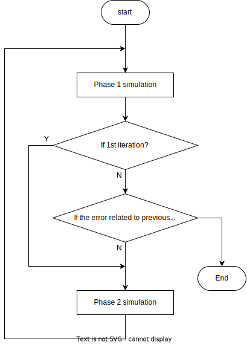
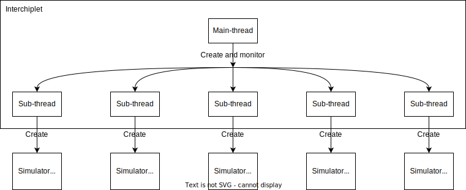
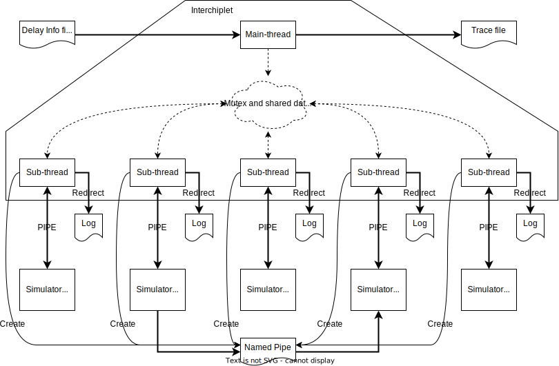

Welcome to the parallel LEGO simulator for heterogeneous chiplets (LegoSim).

# Overview

The LegoSim (parallel LEGO simulator for heterogeneous chiplets) is designed to address the challenge of simulating a vast system constructed by heterogeneous chiplets.

A cycle-accurate model is not realizable for such scale systems due to the limitation on host-machine performance and memory space. A parallel cycle-accurate model is also not attractive because the speedup cannot increase further as the parallelism rises due to frequent synchronization operations across all parallel threads or processes.

Traditionally, integrating a new kind of IPs or chiplets has been a laborious task, requiring significant effort in coding, debugging, and correlation. However, there are open-source models of CPU, NoC, DRAM, and so on, eliminating the need to start from scratch.

To simulate a massive chiplet-based system, the simulation speed and development speed are much more critical than whether the simulation result is cycle-coherent with a realistic system. Both the academic field and industrial field are seeking one balanced solution. The LegoSim provides a loose-couple parallel architecture to address the challenge of faster simulation, development, and reconfiguration.

To speed up parallel simulation, the frequency of synchronization between simulation processes is reduced to the same frequency as software synchronization in the benchmark. In other words, simulation processes only synchronize when benchmarks send/read data or require shared resources. Meanwhile, the synchronization scope limits the processes related to the software operation.

For example, if two simulation processes never communicate with each other or if they never require shared resources, these two simulation processes can run parallel all the time.

For another example, when a CPU wants to send data to a GPU, the software in the CPU writes data to a range of memory space and writes another memory location to signal to the GPU that the data is ready. The software in the GPU enquires the memory location until it gets the signal before the GPU reads the data. In LegoSim, such a sequence of operations is abstracted as a kind of transaction (data transaction). The LegoSim focuses on the end cycle of one transaction rather than the duration of each operation within one transaction. In this way, the amount of essential synchronization operations is dropped.

The LegoSim empowers you with the ability to speed up development and reconfiguration. Integrating various open-source simulators eliminates the high cost of developing a model for each IP or chiplet. With simple configuration files, you can simulate one benchmark on different platforms with various IPs or chiplets, giving you full control over your simulations.

# Modeling target architect

The Chiplet simulator aims to model a system consisting of heterogeneous IPs and chiplets.

The target architecture is divided into Processing Components (PComp) and Shared Components (SComp). In general, PComps are master devices that can generate requests for shared components. Optionally, but usually, PComps can execute instructions and consist of one memory system. CPUs (clusters), GPUs, and NPUs are typical PComps. SComps are shared by PComps and respond to requests from PComps, including NoC, DRAM controllers, and some kinds of accelerators.

An example of target architecture combined with chiplets is shown below:

Another example of target architecture combined with IPs is shown below:

In view of execution time, PComps control tasks and flows in the system, which plays a significant role in regulating the simulation time. SComps impact performance by the duration of time they respond to requests from PComps. Take the DRAM controller as an example; CPU/GPUs send read/write requests to the DRAM controller. If the speed of DRAM to access external memory is slower, CPU/GPUs need a longer duration to wait for the response from the DRAM controller, and usually, it means a longer time to execute one benchmark. Hence, the simulation result will be reasonable if the time cost of SComps can be reflected by PComps reasonably.

# LegoSim Architecture

As shown above, the target systems combine different kinds of components, which may be described by well-used simulators. Each component in the target system corresponds to one simulation process, and these processes execute parallel to increase the simulation speed.

## Simulation cycle iteration

The SComp simulators need to get traces as input from PComp simulators, and PComp simulators need to get delay information from SComp simulators. Both stimulus trace and delay information control the accuracy of the simulation. Hence, the LegoSim defines an iteration flow so that the impact between PComp and SComp can converge to a realistic value.

The figure below shows the iteration flow.

Each iteration consists of two phases. Phase 1 simulates PComps, and Phase 2 simulates SComps.

In phase 1 of the first iteration, PComps are simulated parallelly. One algorithm is applied to calculate the delay of requests from PComps. Meanwhile, *Interchiplet* receives protocol commands from simulation processes and generates traces as a stimulus to SComps. The maximum execution cycle among all PComps is counted as the execution cycle of this benchmark in the first iteration.

In phase 2 of the first iteration, SComps are also simulated parallelly. The traces generated in Phase 1 drive the simulation of SComps in Phase 2. The simulation generates delay information for each request.

> TODO: Support more than 2 phases if one request is handled by more than one SComps.

In Phase 1 of the second iteration, PComps are simulated again as the first iteration. The simulation takes the delay information generated by Phase 2 of the previous iteration.

At the end of Phase 1 of the second iteration, the execution cycle recorded from the current and previous iteration are compared. If the error ratio is lower than a specified threshold, the execution cycle is considered to be convergent, and the simulation stops. Otherwise, the simulation continues with Phase 2, the same as the previous iteration.

In case of non-convergence, the simulation flow can stop after a specified number of iterations, called **timeout**.

## Multiple-process Multi-thread Structure

The LegoSim is a multi-process, multi-thread software. The software architecture is shown below:

As the main process, the *Interchiplet* controls the flow of the entire simulation. It will create as many threads as the simulation processes. These threads are referenced as **sub-threads**. Each thread corresponds to one simulation process and handles the inter-process communication and synchronization.

To avoid file conflict between simulation processes, one individual folder is provided for each process in each iteration, named  *proc_r{iteration}_p{phase}_t{thread}*. For example, *proc_r2_p1_t4* is the working directory of the 4-th thread of Phase 1 of the second iteration. These folders are referenced as **sub-directories**.

The figure below shows the data flow of the LegoSim:

In the above figure, dot lines present the data flow within one program through variables. Thick lines present the data flow through file descriptors, including Pipe, Named Pipe, and standard file interface. Fine lines present the control flow to create Named Pipes.

Each sub-thread of *Interchiplet* connects the standard input and output of one simulation process through PIPE. The content from standard output and standard error output will be redirected to a log file.

The data interchange between simulation processes goes through Named Pipes. One Named Pipe supports one-directional data transmission. Named Pipes are created as essential. LegoSim provides a synchronization protocol and a set of APIs to handle the communication between processes. A minor modification is necessary to apply such a protocol in integrated third-party simulators. Details can be seen in the [Synchronization Protocol](03-sync-proto/index.md) and [Imported Simulator](04-import-sim/index.md).

Sub-threads in *Interchiplet* take responsibility for handling such protocol. One sub-thread gets one protocol command from the corresponding simulation process through standard output and issues another protocol command as a response through standard input.

*Interchiplet* maintains one mutex and one shared data structure between these sub-threads. Sub-threads are parallel when they handle outputs from simulation processes, so the redirection effect can be hidden. When they receive any protocol command, one thread must lock the mutex before further handling, so all protocol commands are handled atomically.

Before creating sub-threads, the main thread in *Interchiplet* will load delay information generated by Phase 2 of the previous iteration into the shared data structure. All sub-threads can get package delay information through the shared data structure. Sub-threads receive protocol commands during simulation and record traces in the shared data structure. After all sub-threads finish, the main thread in *Interchiplet* will dump traces recorded in the shared data structure into files as the stimulus for Phase 2.